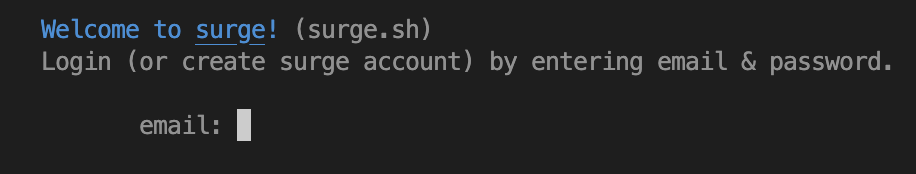
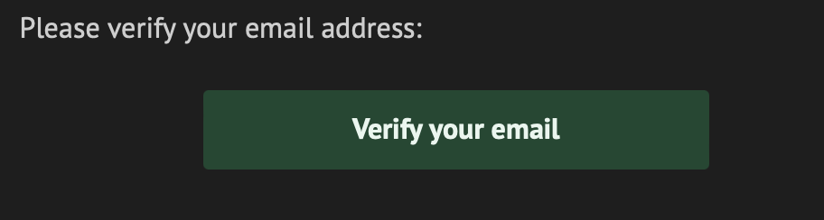
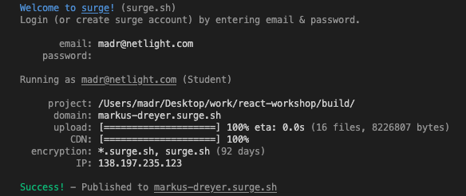

# Deployment guide 🌐
Deployment is the action of taking the things you've built and hosting it remotely so that others may access it. In the context of this React-app, we need someone to host our app so that it's accessible on the internet.

Unfortunately, deploying the backend is not as straightforward, as we'd need some sort of authentication to not run an enormous bill on the OpenAI usage. Therefore, this deployment is only applicable for the frontend. Maybe you might pick up a few neat tricks for deploying a backend in the next Docker-workshop? 😉 

# Build the project
Before we can deploy our app, we need to prepare it for "release". This step transpiles all our code, and places it in the `build` folder. To build your project, run the following command in the terminal

```bash
npm run build
```

## Installing the Surge CLI
Surge is a really convenient tool for quickly deploying a web page for testing or sharing purposes. To get started, install the surge command line tool by running the following command:

```bash
npm install -g surge
```


## Pushing our project to Surge
With the `surge` command line installed, we can now use it to host our app. Start by navigating inside the `build`-folder

```bash
cd build
```

When inside the build folder, type `surge` in the terminal and hit enter. You will be met by a prompt to create a Surge account. It's completely free.



Enter email and password and hit enter. You should now have received a confirmation email from Surge, click the green `Verify your email`-button and come back to the terminal



Back in the terminal, surge will as you which project you'd like to deploy. It should be something like the following: 

```
project: /Users/madr/Documents/react-workshop/build/
```

If the path looks similar, hit enter. In the next step, Surge asks you what domain you want to host your project. Here you can experiment with different options, some might already be taken. Just remember to have domain and top level domain as `.surge.sh`. In other words: `anything-you-want.surge.sh` is allowed.

__Note: Any time you deploy to a domain you have already deployed to, you will overwrite the previous deployment__

When you've found a suitable domain and hit enter, the project will be uploaded to Surge's server for hosting, and you'll be able to share your wonderful React-app with the world! Try visiting the URL and see for yourself.



