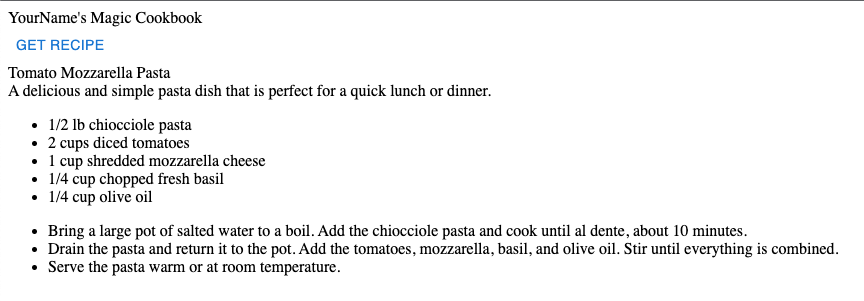

# Step by step guide
This is a step-by-step guide to implementing the solution.

## Using GIT to clone the project
<details>
  <summary>:hand: Cloning the Project</summary>


<br>First we need to open up a terminal, then navigate to where we want to store the project. In this example, we'll store it in the Documents folder. 

<details>
  <summary>:pushpin:Windows</summary>

  First open up the file explorer and navigate to where you want to store the project. On the top of the file explorer, you'll see a path such as `C:/Users/Username/Documents` Click this with your mouse and copy the text.

  Now, open up a command line window, you can do this by pressing the start button, write in `cmd` and press enter when the search is finished.

  When the command line window is open, write `cd "C:/Users/Username/Documents"` The path can be pasted in using `Ctrl-V` assuming you copied it earlier. 
  
</details>

<details>
  <summary>:pushpin:MacOS</summary>


First, open up a terminal, you can do this by using Spotlight, which is the magnifying glass on the top right corner of your screen, write in `terminal` and press enter when the search is finished.

  When the terminal is open, write `cd ~/Documents` 

</details>

Now we want to clone the project using git. This can be done using the `git clone` command with a url to the git repository. In github this can be found by pressing the green `Code` button on the repository page, and it should show the link in the popup box. We'll include it in the command here you simplify things.

Use the following command -

```
git clone https://github.com/Markusdreyer/react-workshop.git
```
</details>


## Running the project
<details>
  <summary>:runner: Running the Project</summary><br>


  First off, we want to start up the project, this allows us to immediately see changes and updates in the web browser as we write out code.

  Now we should still have the terminal or command line window open. So, we need to navigate into the project folder. This can be done by writing

  ```
  cd react-workshop
  ```

  Now the first command you want to run is `npm install` this will install all dependencies for the project, when it is finished, you can write in `npm start`, this will start the project, and open up the web browser.

  Now with the web-app running, it will update as soon as you save file after having written new code, this is done by pressing `CTRL-S` for windows pcs or `Command-S` for macs.
  
Now while we're at it, we might as well go ahead and start up the backend. 

Do the same as you did for the front-end, open up a terminal and navigate to the same folder as the front-end, then also add in `cd backend` and run `npm install`
and `npm start`

</details>

## Step 1 - Adding some text
<details>
  <summary>:wrench: Adding more components</summary>

  <br>Now that we have the project running, we want to add some visual element, like some text at the top of the page, for example "`Your Name`'s Magic Cookbok". 
  Components in react can however only return one main parent element. A parent element is an HTML-like element that contains one or more child elements. The child elements are nested within the parent element and are considered to be a part of the parent element.

  For example:

  ```tsx
  return (
    <>
      <Box> I am a child '<>' </Box>
      <Box> I am another child of '<>'</Box>
    </>
  );

  ```
  
  Is OK. In this example, `<>` is the parent element, and the two `<Box>` elements are child elements. The parent element contains and wraps around the two child elements. However, 
              
  ```tsx
  return (
    <>
      <Box> I am a child '<>' </Box>
    </>
    <Box> I am another parent element!</Box>
  );

  ```
is not OK, as it contains two `parent` elements, both `<>` and `<Box>`.
  

  Now, if you look in your `App.tsx` file, you can see that there is already a `<> </>`element, we can use this as our parent element when adding new elements.

Now you can go ahead and use a `<Box>` element, see an example of how it can be used below.

  ```tsx
import { Box } from "@mui/system";

function App() {
  return (
    <Box>This is some text</Box>
  )
}

export default App

  ```

Now lets combine this, add the `<Box>` element with the text `YourName's Magic Cookbook`.

<details>
    <summary>:sparkles:Show solution:sparkles:</summary>


```tsx
import { Box } from "@mui/system";

function App() {
  return (
    <>
      <Box>This is some text</Box>
    </>
  )
}

export default App
```
</details>
  
All right, now we've finished adding the header! You may have noticed that we only really have a <Box> element, and as such didn't really need a parent element, but it will be important later on as we start using more elements and components. So for the next step, we'll be adding a bit of simple interaction with a button!

</details>

</details>


</details>

## Step 2 - A simple button and an empty function
<details>
  <summary>:wrench: Getting started</summary><br>


  In this project we'll be using a component library named Material-UI, it provides us with ready made components, such as buttons, text fields and much much more. There are many such libaries available, and there's usually no need to re-invent the wheel and create buttons and other components entirely from scratch. So, with that out of the way, we'll move onto the first step.

  The first step is going to be to just add a simple button with the label "Get Recipe". This needs to be placed within the `return` statement in the `App.tsx`-file. A button can be added using the following.


  ```tsx
  <Button>MyLabel</Button>
  ```
  

  The next step is to add an empty function. A function is coded like this, but unlike the Button, it should be placed outside the return statement. Lets name the function getRecipe so it is clear what it is supposed to do.


  ```tsx
  const myFunction = () => {
      console.log("Hello world");
    }
  ```

  Now, we want to combine the two, and make the button call/use the function when it is clicked. And this button component has an onClick parameter, see if you can find out how to use this.

  _Note: The button can be stylized in many ways. Take a look at the documentation here for an overview: https://mui.com/material-ui/react-button/_


  <details>
    <summary>:sparkles:Show solution:sparkles:</summary>

  ```tsx
    import Button from '@mui/material/Button';

    function App() {

        function getRecipe() {
                console.log("Hello world")
            }

        return (
            <>
              <Box>YourName's Magic Cookbook</Box>
              <Button onClick={getRecipe}>Get Recipe</Button>
            </>
        );
    }

    export default App;
  ```
  </details>

  Now you might be wondering what the console is. The console is a debugging tool that provides a way to view messages, inspect values, and run JavaScript code directly in a web browser or in other JavaScript environments such as Node.js.

  In web development, the console is usually accessed using the JavaScript console object, which is built into the browser's developer tools. You can open the console in most modern browsers by pressing `F12` or by right-clicking on a web page and selecting `Inspect Element`. The console appears as a separate panel within the developer tools.

  Once the console is open, you can use it to view output from your JavaScript code, check the values of variables, and run code directly in the console. This is useful for testing and debugging your code, as well as for exploring the behavior of JavaScript and the web platform.
  Try using it now to see what happens when you click the button on your website.

</details>

## Step 3 - Querying the backend
<details>
  <summary>:wrench: How to query </summary>
  
Let's get our React-app underway by implementing fetching logic in our app. JavaScript has a "Fetch" API that provides a global fetch() method that provides an easy, logical way to fetch resources across the network.

A basic fetch request is really simple to set up. Have a look at the following code:

```tsx
fetch('http://example.com/api')
  .then((response) => response.json())
  .then((data) => console.log(data));
```

Here we are performing a request to an API at 'http://example.com/api' and printing the response to the console. The simplest use of fetch() takes one argument — the path to the resource you want to fetch — and does not directly return the JSON response body but instead returns a promise that resolves with a Response object.

This request is nice, but it is lacking one key feature: the request body. Also, this request is a simple GET request, when performing HTTP requests with a request body, a POST request is used, so we need to change that as well. Here is an example:

```tsx
fetch("http://example.com/api", {
      method: "POST",
      body: requestBody,
    })
      .then((response) => response.json())
      .then((data) => console.log(data));
```

### Encapsulating the fetch request
Let's encapsulate this request into the `getRecipe` function we already made:

```tsx
//The async keyword allows us to to use "await" to perform asynchronous operations, such as communicating with the backend
async function getRecipe() {
    //Hardcoded list of ingredients. We'll come back to this later, but we need some data to work with for now.
    const requestBody = JSON.stringify({
        ingredients: [
            "tomato", 
            "mozzarella", 
            "basil", 
            "chiocciole pasta", 
            "olive oil"
        ]
    })
    await fetch("http://localhost:8000/recipes", {
      method: "POST",
      headers: { //We also need to tell what kind of data we're sending
        "Content-Type": "application/json",
      },
      body: requestBody,
    })
      .then((response) => response.json())
      .then((data) => console.log(data));
  }
```

### Adding the function to our app
Now try adding this in your App.tsx file, and check the console output after trying to click the button (It might take a few seconds-half a minute before you get a result, depending on the server!)
  
<details>
  <summary>:sparkles:Show solution:sparkles:</summary>
  
  
```tsx
import { Box } from '@mui/material';
import Button from '@mui/material/Button';

function App() {
  
  async function getRecipe() {
    const requestBody = JSON.stringify({
        ingredients: [
            "tomato", 
            "mozzarella", 
            "basil", 
            "chiocciole pasta", 
            "olive oil"
        ]
    })
    await fetch("http://localhost:8000/recipes", {
      method: "POST",
      headers: {
        "Content-Type": "application/json",
      },
      body: requestBody,
    })
      .then((response) => response.json())
      .then((data) => console.log(data));
  }
  
  return (
      <>
          <Box>YourName's Magic Cookbook</Box>
          <Button onClick={getRecipe}>Get Recipe</Button>
      </>
  );
}
export default App;
```

</details>
</details>
    
## Step 4 - Presenting the results
<details>
  <summary>:wrench: Presenting the results </summary>

Now we want to create a new component for recipe related things. 
  
First, create a folder named `components` under the `src` folder. If you're using Visual Studio Code, you can right click the `src` directory and click create new folder and name this components. Now right click the `components` folder and click create new file, lets name this new file Recipe.tsx 

Next up, we'll have a look at how the data in the recipe is structured.

```tsx
{
    "title": "Caprese Pasta",
    "description": "A delicious and simple pasta dish featuring the classic Italian flavors of tomato, mozzarella, and basil.",
    "ingredients": [
        "2 cups of cherry tomatoes, halved",
        "1 cup of mozzarella, cubed",
        "1/4 cup of fresh basil, chopped",
        "250 grams of chiocciole pasta",
        "3 tablespoons of olive oil"
    ],
    "steps": [
        "Bring a large pot of salted water to a boil.",
        "Add the chiocciole pasta and cook for 8-10 minutes, or until al dente.",
        "Drain the pasta and set aside.",
        "In a large bowl, combine the halved tomatoes, cubed mozzarella, and chopped basil.",
        "Add the cooked pasta to the bowl and mix to combine.",
        "Drizzle the olive oil over the pasta and mix until all the ingredients are evenly coated.",
        "Serve the pasta warm or cold."
    ]
}
```

We can see here that we're dealing with a structure such as this
  
```tsx
title: string,
description: string,
ingredients: string[] 
steps: string[]
```
  
So to be able to use a state for multiple fields, we usually have to use a state object structure. Now, we're going to use this object structure in multiple components, in both our App.tsx and our Recipe.tsx components. When we need to use it in several places, or it is a larger object structure it is often helpful to create an interface that defines the structure. See an example of an interface below.
  
```tsx
interface interfaceName{
  propertyName1: propertyType1
  propertyName2: propertyType2
}
```
  
To use this interface in other components, we usually have to add an export before the interface, e.g.

```
export interface InterfaceName {
  ....
}
  
```

Now, go ahead and try creating an interface for the recipe, lets name it RecipeData
  
<details>
  <summary>:sparkles:Show solution:sparkles:</summary>
  
```tsx
export interface RecipeData{
  title: string
  description: string
  ingredients: string[]
  steps: string[]
}
```
  
</details>
  
Next up, we'll create the actual component! Lets start with something along these lines
  
```tsx
import { Box } from "@mui/material";

function Recipe(){
    return (
        <Box>
          "text"
        </Box>
    )
}
```
  
Now, we need this Recipe component to actually receive RecipeData, it does this through the use of something called `props`. In React, `props` (short for "properties") is a way to pass data from a parent component to its child components. Props are used to customize the behavior and render of a component by providing it with external data.

See the example below to see how a prop is received by a component.
  
```tsx
function MyTitleFunction(props: {title: string){
  <Box>
    {props.title}
  </Box>
}

```
  
This works slightly different when using an interface for the prop, as all the types and property names are already defined. So when using an interface it might look a bit like this

```tsx
interface MyTitleInterface{
  title: string
}
  
function MyTitleFunction(props: MyTitleInterface){
  <Box>
    {props.title}
  </Box>
}
```
  
So, now you can try to make use of the RecipeData interface and pass this as a prop to your Recipe component.
  
<details>
  <summary>:sparkles:Show solution:sparkles:</summary>
  
```tsx
import { Box } from "@mui/material";

export interface RecipeData{
    title: string
    description: string
    ingredients: string[]
    steps: string[]
}

function Recipe(props: RecipeData){
    return (
        <Box>
            {props.title}
        </Box>
    )
}
```
</details>

Right, now we want to make use of all the properties that are passed in, this is simple for the single string properties, but requires some mapping when it comes to Lists or Arrays, e.g. when we have multiple ingredients or steps. So lets take a look at an example of how to map a list of strings.
  
```tsx
Lets say we have this list of names
  
const names: [NameData] = [{firstName: "Jack", lastName: "Syvertsen"}]

interface NameData {
  firstName: string,
  lastName: string
}

  
function NameList(props: names){
  return(
    <Box>
        <List>
            {props.names.map((name, index) => (
                <ListItem key={index}>{name.firstName} {name.lastName}</ListItem>
            ))}
        </List>
    </Box>
  )
}
  
```
  
The code in the example creates a list and uses the map method to render a list of items based on an array of names passed as a prop to the component. The map method is used to iterate over the array and render a `<ListItem>` for each element, with the text content being the element and the key being the index of the element in the array.
  
It might sound a bit more complex than it is, in short the list is meant to show a set of names, and it is displayed as a list, where each name is a separate item on the list.
  
Now, you can go ahead and try to implement the Recipe function in its entirety. What we want is something that ends up looking like this
  

  
To test your solution you can use this example data
  
```tsx
const ExampleRecipeData = {
    
  title: "Caprese Pasta",
  description: "A delicious and simple pasta dish featuring the classic Italian flavors of tomato, mozzarella, and basil.",
  ingredients: [
      "2 cups of cherry tomatoes, halved",
      "1 cup of mozzarella, cubed",
      "1/4 cup of fresh basil, chopped",
      "250 grams of chiocciole pasta",
      "3 tablespoons of olive oil"
  ],
  steps: [
      "Bring a large pot of salted water to a boil.",
      "Add the chiocciole pasta and cook for 8-10 minutes, or until al dente.",
      "Drain the pasta and set aside.",
      "In a large bowl, combine the halved tomatoes, cubed mozzarella, and chopped basil.",
      "Add the cooked pasta to the bowl and mix to combine.",
      "Drizzle the olive oil over the pasta and mix until all the ingredients are evenly coated.",
      "Serve the pasta warm or cold."
  ]
  
}
 
```

<details>
  <summary>:sparkles:Show solution:sparkles:</summary>
  
```tsx
import { Box, List, ListItem } from "@mui/material";

export interface RecipeData{
    title: string
    description: string
    ingredients: string[]
    steps: string[]
}

function Recipe(props: RecipeData){
    return (
        <>
          <Box>{props.title}</Box>
          <Box>{props.description}</Box>
          <List>
              {props.ingredients.map((ingredient, index) => (
                  <ListItem key={index}>{ingredient}</ListItem>
              ))}
          </List>
          <List>
              {props.steps.map((step, index) => (
                  <ListItem key={index}>{step}</ListItem>
              ))}
          </List>
       </>
    )
}
  
export default Recipe;
    
```
</details>

</details>
  
## Step 5 - State management
<details>
  <summary>:wrench: Managing the state</summary>
  
<br> In React, "state" is a way to store and manage component-level data that affects the behavior and render of a component. It is an object that holds data that can change over time, and it is an essential part of building dynamic and interactive user interfaces. It might sound a bit complicated, but it's actually not that hard to use. So lets get going with an example
  
```tsx
function Counter() {
  const [counter, setCounter] = useState(0);
  
  return (
    <>
      {counter}
      <Button onClick={setCounter(counter + 1)}>Count</Button>
    </>
  )
}
```
  
<br>Now, in this example we have the state `counter`, and a setter for this state named `setCounter`. The `counter` is initialized using `useState(0)` which initializes the state with the value 0. 

So in the browser, this would show the number 0, and a button labeled Count, and each click of the button would set a new state, this state is based on the previous state and adds 1 to this. And as it is a state, React knows that it should update the render (what is shown) when the value changes. 

What we want in our application is to have a recipe state. Lets see an example of how this can look

```tsx
import { useState } from 'react';
import { RecipeData } from './components/Recipe'
  
function App() {
  const [recipe, setRecipe] = useState({} as RecipeData)
}
```
  
Try adding this to your code in the `App.tsx` file now.
  
Next up we want to actually set the recipe state when we get some data back from pressing the button, instead of just logging it to the console. See if you can figure out how to do this.
  
<details>
  <summary>:sparkles:Show solution:sparkles:</summary>
  
```tsx
import { Box } from '@mui/material';
import Button from '@mui/material/Button';
import { RecipeData } from './components/Recipe';
import { useState } from 'react';

function App() {
  const [recipe, setRecipe] = useState({} as RecipeData)
  
  async function getRecipe() {
    const requestBody = JSON.stringify({
        ingredients: [
            "tomato", 
            "mozzarella", 
            "basil", 
            "chiocciole pasta", 
            "olive oil"
        ]
    })
    await fetch("http://localhost:8000/recipes", {
      method: "POST",
      headers: {
        "Content-Type": "application/json",
      },
      body: requestBody,
    })
      .then((response) => response.json())
      .then((data) => setRecipe(data));
  }
  
  return (
      <>
          <Box>YourName's Magic Cookbook</Box>
          <Button onClick={getRecipe}>Get Recipe</Button>
      </>
  );
}
export default App;
    
```
</details>
  
So, next we want to use the actual recipe data! Lets use our Recipe component and pass the needed props to it. The component can be used like this
  
```tsx
  <Recipe title={recipe.title} description={recipe.description}....../>
  
```
  
Notice that we are writing this as `<Recipe ... />` instead of `<Recipe ...></Recipe>`
This is just a simplification and can make the code cleaner and easier to read when no props are passed
  
Now try implementing this yourself!
  
<details>
  <summary>:sparkles:Show solution:sparkles:</summary>
  
```tsx
import { Box } from '@mui/material';
import Button from '@mui/material/Button';
import Recipe, { RecipeData } from './components/Recipe';
import { useState } from 'react';

function App() {
  const [recipe, setRecipe] = useState({} as RecipeData)
  
  async function getRecipe() {
    const requestBody = JSON.stringify({
        ingredients: [
            "tomato", 
            "mozzarella", 
            "basil", 
            "chiocciole pasta", 
            "olive oil"
        ]
    })
    await fetch("http://localhost:8000/recipes", {
      method: "POST",
      headers: {
        "Content-Type": "application/json",
      },
      body: requestBody,
    })
      .then((response) => response.json())
      .then((data) => setRecipe(data));
  }
  
  return (
      <>
          <Box>YourName's Magic Cookbook</Box>
          <Button onClick={getRecipe}>Get Recipe</Button>
          <Recipe title={recipe.title} description={recipe.description} ingredients={recipe.ingredients} steps={recipe.steps}/>
      </>
  );
}
export default App;
```
  
</details>
  
Now you might notice nothing is showing up in the browser anymore, this is due to the Recipe receiving null values, as the title, description and so on haven't been initialized. We'll sort this out by using something called conditional rendering, which is basically an `if` statement.
  
```tsx
  {recipe.title && <Recipe ......./>}
  
  In essence this means 
  
  if (recipe.title != null){
    return <Recipe ......></Recipe>
  }
```

<details>
  <summary>:sparkles:Show solution:sparkles:</summary>
  
```tsx
import { Box } from '@mui/material';
import Button from '@mui/material/Button';
import Recipe, { RecipeData } from './components/Recipe';
import { useState } from 'react';

function App() {
  const [recipe, setRecipe] = useState({} as RecipeData)
  
  async function getRecipe() {
    const requestBody = JSON.stringify({
        ingredients: [
            "tomato", 
            "mozzarella", 
            "basil", 
            "chiocciole pasta", 
            "olive oil"
        ]
    })
    await fetch("http://localhost:8000/recipes", {
      method: "POST",
      headers: {
        "Content-Type": "application/json",
      },
      body: requestBody,
    })
      .then((response) => response.json())
      .then((data) => setRecipe(data));
  }
  
  return (
      <>
          <Box>YourName's Magic Cookbook</Box>
          <Button onClick={getRecipe}>Get Recipe</Button>
          {recipe.title && 
            <Recipe 
              title={recipe.title} 
              description={recipe.description} 
              ingredients={recipe.ingredients} 
              steps={recipe.steps}
            />
          }
      </>
  );
}
export default App;

```
  
</details>

Perfect, now you've learned a little bit about state management as well! Next up, we'll add a new component with inputs, and another state to change the ingredients we're using.
  
</details>
  
## Step 6 - Autocomplete component and input
<details>
  <summary>:wrench: Time for some input </summary>
  
<br> So now we're finally going to add some more interactivity by using an autocomplete component! 
We won't go into details regarding the Autocomplete component, and will focus only on what we need to use. You can see an example of how it can be used below

```tsx
  
function App(){
  const [ingredients, setIngredients] = useState([] as string[])
  
  return(  
    <Autocomplete 
      multiple // Allows you to select multiple items
      filterSelectedOptions // Filters out selected items
      disableCloseOnSelect // Prevents closing the dropdown menu on selecting an item
      options={["tomato", "mozarella"]} // The options shown in the dropdown menu
      onChange={(event: any, newValue: string[]) => { // Handles changes, allowing you to set a state with the new values
        setIngredients(newValue); // Here we're using a [ingredient, setIngredient] = useState([""]) state
      }}
      renderInput={(params) => (
        <TextField {...params} label="Ingredients" /> // The input field, showing what you type if you're using the built in search function
      )
    }/>
  )
```

Now this will show an autocomplete component with two options, tomato and mozarella, however we want to be able to choose a lot more ingredients. 
We could add all the ingredients we want in `options` directly, but this could end up as a huuuge list. Luckily, we've included a file `Ingredients.json` which contains a large list of ingredients, so lets import this list and use it for the options instead. 
      
```tsx
import IngredientOptions from '../Files/Ingredients.json'

function App(){
  const [ingredients, setIngredients] = useState([] as string[])
  
  return(  
    <Autocomplete 
      ....
      options={IngredientOptions}
      ....
    />
```
  
Try doing this now.
      
<details>
  <summary>:sparkles:Show solution:sparkles:</summary>
  
```tsx
import { Autocomplete, Button, TextField } from "@mui/material";
import { Box } from "@mui/system";
import Recipe, { RecipeData } from "./components/Recipe";
import { useState } from "react";
import IngredientOptions from './files/Ingredients.json'

function App() {
    const [recipe, setRecipe] = useState({} as RecipeData)
    const [ingredients, setIngredients] = useState([] as string[])
    
    async function getRecipe() {
      const requestBody = JSON.stringify({
          ingredients: ingredients
      })
      await fetch("http://localhost:8000/recipes", {
        method: "POST",
        headers: {
          "Content-Type": "application/json",
        },
        body: requestBody,
      })
        .then((response) => response.json())
        .then((data) => setRecipe(data));
    }
    
    return (
        <>
            <Box>YourName's Magic Cookbook</Box>
            <Autocomplete 
              multiple // Allows you to select multiple items
              filterSelectedOptions // Filters out selected items
              disableCloseOnSelect // Prevents closing the dropdown menu on selecting an item
              options={IngredientOptions} // The options shown in the dropdown menu
              onChange={(event: any, newValue: string[]) => { // Handles changes, allowing you to set a state with the new values
                setIngredients(newValue); // Here we're using a [ingredient, setIngredient] = useState([""]) state
              }}
              renderInput={(params) => (
                <TextField {...params} label="Ingredients" /> // The input field, showing what you type if you're using the built in search function
              )
            }/>
            <Button onClick={getRecipe}>Get Recipe</Button>
            {recipe.title && 
              <Recipe 
                title={recipe.title} 
                description={recipe.description} 
                ingredients={recipe.ingredients} 
                steps={recipe.steps}
              />
            }
        </>
    );
  }

export default App;


```
</details>
  
Perfect! We now have our list of ingredients, but we're still not really using it to create our recipe, we now need to update our getRecipe function to use the selected ingredients. This is pretty straightforward, so lets have a look at an example below
  
```tsx
const [ingredients, setIngredients] = useState([] as string[])
  
  async function getRecipe() {
    const requestBody = JSON.stringify({ingredients: ingredients})
    .....
  }
```
  
Well done! The last step now is adding a loading indicator (as it can take a while to get a response at times). 
  
</details>

      
## Step 7 - Adding a loading indicator
<details>
  <summary>:wrench: Lets load up </summary>
  
<br> So time to get get loading indicator in, this should be easy enough for you now after having completed the other steps. First off, we're going to use the following component `<CircularProgress/>`. In addition, we probably don't want this loading indicator to show all the time, we only want it to show while we're waiting for a response from the api. So again we can go ahead and either implement some conditional rendering, or use a function. Lets have a look at the different options.
  
```tsx
import { CircularProgress } from "@mui/material";
  
function App(){
  const [loading, setLoading] = useState(false);
  
  function loadingIndicator(){
    if (loading){
      return (<CircularProgress/>)
  
  return(
    {loadingIndicator()}
  )
}
  
export default App
```
  
Or we can use
  
```tsx
import { CircularProgress } from "@mui/material";
  
function App(){
  const [loading, setLoading] = useState(false);
  
  return(
    {loading && (
      <CircularProgress/>
    )}
  )
}
  
export default App
```
  
Which one to use depends a bit on preference, in some cases it is wise to use functions or even components if the element is large, this often makes the code much easier to maintain. Try adding one of the options to your code now!

  
<details>
  <summary>:sparkles:Show solution:sparkles:</summary>
  
  
```tsx
import { Autocomplete, Button, CircularProgress, TextField } from "@mui/material";
import { Box } from "@mui/system";
import Recipe, { RecipeData } from "./components/Recipe";
import { useState } from "react";
import IngredientOptions from './files/Ingredients.json'

function App() {
    const [recipe, setRecipe] = useState({} as RecipeData)
    const [loading, setLoading] = useState(false)
    const [ingredients, setIngredients] = useState([] as string[])
    
    async function getRecipe() {
      const requestBody = JSON.stringify({
          ingredients: ingredients
      })
      await fetch("http://localhost:8000/recipes", {
        method: "POST",
        headers: {
          "Content-Type": "application/json",
        },
        body: requestBody,
      })
        .then((response) => response.json())
        .then((data) => setRecipe(data));
    }
  
    function loadingIndicator(){
      if (loading){
          return (<CircularProgress/>)
      }
    }
    
    return (
        <>
            <Box>YourName's Magic Cookbook</Box>
            <Autocomplete 
              multiple // Allows you to select multiple items
              filterSelectedOptions // Filters out selected items
              disableCloseOnSelect // Prevents closing the dropdown menu on selecting an item
              options={IngredientOptions} // The options shown in the dropdown menu
              onChange={(event: any, newValue: string[]) => { // Handles changes, allowing you to set a state with the new values
                setIngredients(newValue); // Here we're using a [ingredient, setIngredient] = useState([""]) state
              }}
              renderInput={(params) => (
                <TextField {...params} label="Ingredients" /> // The input field, showing what you type if you're using the built in search function
              )
            }/>
            <Button onClick={getRecipe}>Get Recipe</Button>
            {loadingIndicator()}
            {recipe.title && 
              <Recipe 
                title={recipe.title} 
                description={recipe.description} 
                ingredients={recipe.ingredients} 
                steps={recipe.steps}
              />
            }
        </>
    );
  }

export default App;
```
</details>

So now, you're probably noticing that the loading indicator is appearing beside the button, lets move this below our button by wrapping a `<Box>` component around it.               

```tsx
function loadingIndicator(){
  if (loading){
    return (
      <Box>
          <CircularProgress/>
      </Box>
    )
  }
}
```

Furthermore, we actually have to set if it is loading or not, we can do this in our existing getRecipe function. 
  
```tsx
async function getRecipe() {
  setLoading(true) // set loading to true as soon as we use the function
  const requestBody = JSON.stringify({
    ingredients: ingredients
  })
  await fetch("http://localhost:8000/recipes", {
    method: "POST",
    headers: {
      "Content-Type": "application/json",
    },
    body: requestBody,
  })
    .then((response) => response.json())
    .then((data) => setRecipe(data))
    .finally(() => setLoading(false)); // The finally is called when the response is either fulfilled or rejected, and sets the loading to false.
}
```
  
Perfect! Now we have all our functionality in place, next you can choose a couple of different tasks, either improving the layout and design to make things look nicer, or implementing more functionality in the backend and frontend to also make use of an image generator, to create a fitting image to the recipe.
  
</details>

      
## Open waters ⛵️
We're now done with the most important parts of the app, but there's still plenty of improvements and features that may be added. In this next part, we give you three optional, independent subjects to explore, with varying difficulty. 

### 🟢 Easy - Deployment
Want to show of this piece of work to your grandparents? Sure, just have them clone the repo with git, install the dependencies with npm and run it on localhost. OR EVEN BETTER: Make the page just as accessible as vg.no. Sound tempting? Head over to [Deployment](./deployment.md) and have a look.

### 🟡 Medium - Styling
The app is currently functional but wouldn't exactly bring home a [Red Dot Award](https://www.red-dot.org/design-concept?gclid=CjwKCAiA_6yfBhBNEiwAkmXy55ZB9Tuvl96iEoM4_Comt9va0dC4kknJ2WjI3XeLZ-8sibTP7QlOnRoC3v0QAvD_BwE) (yet). If you'd like to pimp out your page and make it look even better, check out the [Styling](./styling.md) guide and have a look.

### 🔴 Hard - Generate AI images based on the recipe
Didn't think that the app had enough AI? Wanted some more visuals? This part is quite a bit more technical than the others, and involves traversing into the depths of the backend and building a new endpoint in the API, and frontend changes to call this API. Much like a true full stack developer! Up for a challenge? Check out [DALL-E](./dall-e.md) to get started! 
